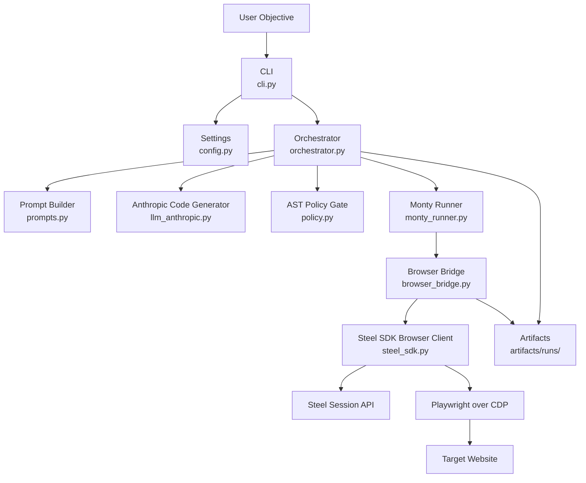
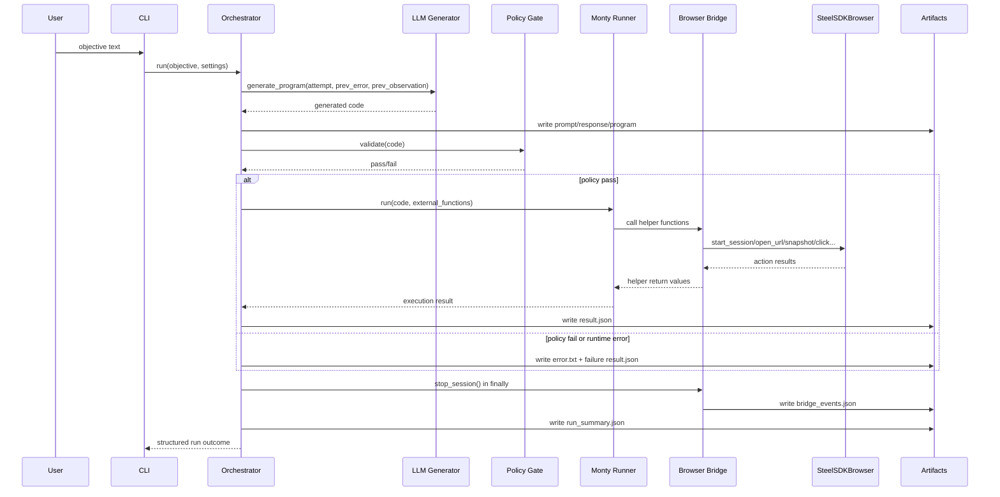
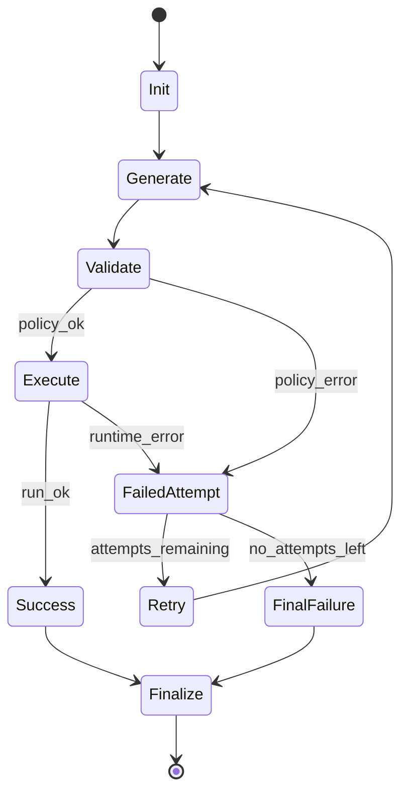

# Steel Monty Agent Architecture

## Purpose

This project executes browser tasks with a minimal control loop:

1. An LLM generates Python task code.
2. A policy gate validates that code.
3. Monty executes it with an allow-listed helper API.
4. Helpers drive a real Steel browser session via Steel SDK + Playwright CDP.
5. Artifacts are persisted for each attempt and run.

## Design Goals

- Keep orchestration simple and auditable.
- Avoid tool-calling complexity in the model API layer.
- Enforce explicit runtime capability boundaries.
- Preserve reproducibility through deterministic artifacts.

## Module Map

- CLI entrypoint: `src/steel_monty_agent/cli.py`
- Runtime config: `src/steel_monty_agent/config.py`
- Main controller: `src/steel_monty_agent/orchestrator.py`
- LLM integration: `src/steel_monty_agent/llm_anthropic.py`
- Prompt contract: `src/steel_monty_agent/prompts.py`
- Code policy gate: `src/steel_monty_agent/policy.py`
- Monty execution wrapper: `src/steel_monty_agent/monty_runner.py`
- Helper facade + event log: `src/steel_monty_agent/browser_bridge.py`
- Browser runtime client: `src/steel_monty_agent/steel_sdk.py`
- Typed run records: `src/steel_monty_agent/schemas.py`

## High-Level Component Diagram

## Attempt Lifecycle Sequence

## Control Flow State Machine

## Runtime Boundaries

## 1) LLM Boundary

- LLM only returns code text.
- It does not call browser APIs directly.
- Prompts enforce helper function-only behavior.

## 2) Policy Boundary

- AST checks block disallowed syntax and names.
- Only allow-listed calls are permitted.
- Script must use at least one helper function.

## 3) Execution Boundary

- Monty executes generated code.
- Only exposed external helper functions are callable.
- Monty limits constrain duration, memory, allocations, recursion.

## 4) Browser Boundary

- `SteelSDKBrowser` owns real session lifecycle and CDP attach.
- `BrowserBridge` is the callable surface used by Monty code.
- All helper calls are event-logged.

## Helper API Surface (Exposed to Monty)

- Top-level helpers:
- `start_browser(session_name=None, local=False, api_url=None)`
- `emit_result(payload)`
- Browser object methods:
- `open_page(url)`
- `current_page()`
- `close()`
- Page object methods:
- `goto(url)`
- `url()`
- `title()`
- `snapshot(interactive=True)`
- `locator(selector)`
- `click(selector)`
- `fill(selector, value)`
- `text(selector)`
- `attr(selector, attr)`
- `wait_for_text(text)`
- `wait_for_selector(selector)`
- `wait_for_ms(ms)`
- `eval_js(script)`
- `screenshot(path=None)`
- Locator object methods:
- `click()`
- `fill(value)`
- `text()`
- `attr(attr)`
- `wait_visible()`

## Artifact Model

Per attempt:

- `prompt.txt`
- `llm_raw_response.txt`
- `program.py`
- `result.json`
- `bridge_events.json`
- `error.txt` (when applicable)
- `stop_error.txt` (when cleanup fails)

Per run:

- `run_summary.json`

## Failure and Retry Model

- Any generation, validation, execution, or browser error marks attempt failure.
- Failure writes both machine-readable and human-readable artifacts.
- Next attempt receives prior error and last observation hint.
- Orchestrator always attempts browser cleanup in `finally`.

## Data Contracts

Primary normalized result payload:

- `status`: `ok` or `failed`
- `results`: arbitrary result object/list/value
- `evidence`: list of strings
- `errors`: list of strings
- `artifacts`: object with attempt/run metadata

Run summary payload:

- `run_id`
- `objective`
- `success`
- `run_dir`
- `final_result`
- `attempts[]` with per-attempt file references and status

## Security Posture

- Capability-based execution (Monty external function allow-list).
- AST-level pre-execution rejection for risky constructs.
- No direct import/system/network access from generated code.
- Session lifecycle explicitly owned by host runtime, not model code.

## Operational Notes

- Default mode is Steel cloud unless `--local` or API URL override is supplied.
- Use `--cloud` to explicitly override `STEEL_MONTY_LOCAL=true` at runtime.
- Environment and dependencies are managed with `uv`.
- Recommended run path:
  - `uv sync`
  - `uv run steel-monty-agent "<objective>"`
- SDK/browser smoke path:
  - `uv run python scripts/smoke.py`
